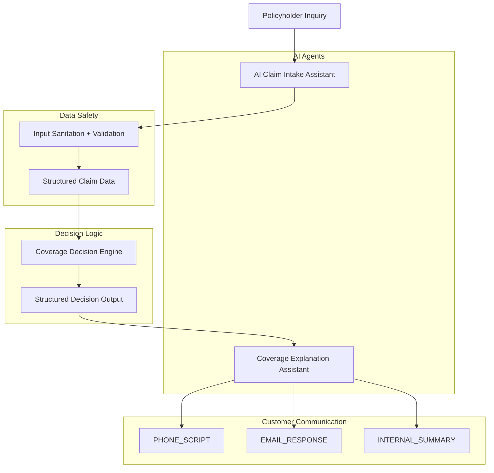

# Aaron Baden

AI workflow architecture projects exploring safe AI integration into operational systems.

---

## AI Insurance Workflow Architecture

---

## Projects

### AI Claim Intake Assistant
Collects claim information, sanitizes inputs, and produces structured claim data.

### Coverage Explanation Assistant
Transforms structured coverage decisions into compliant customer explanations.
