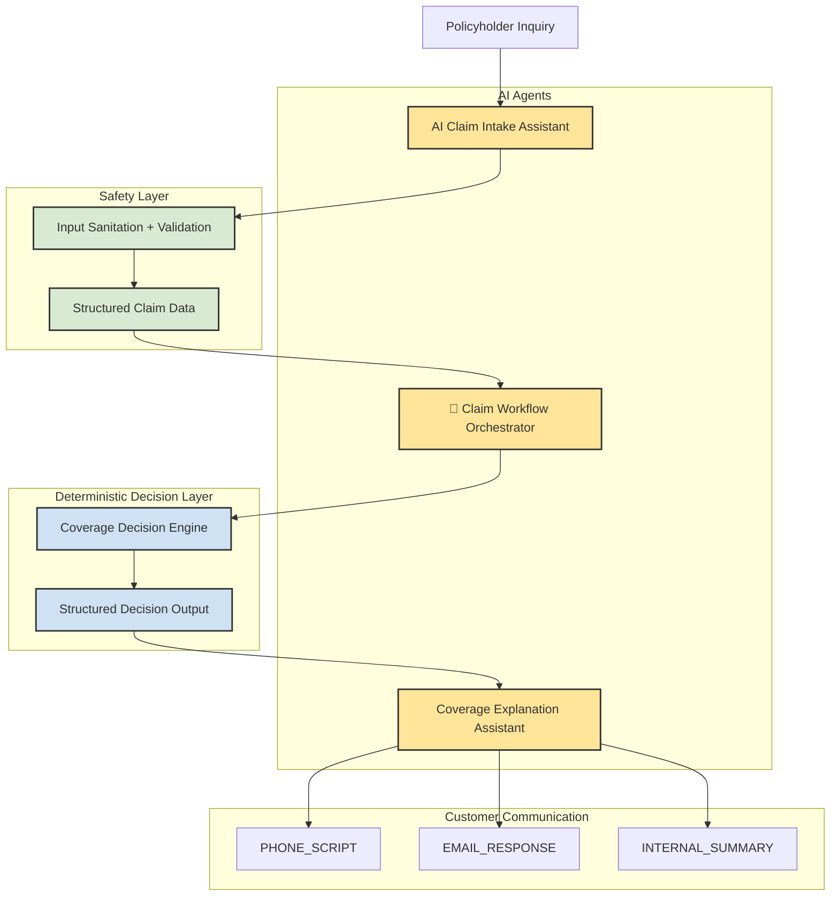

# Aaron Baden

AI workflow architecture projects exploring safe AI integration into operational systems.

---
## AI Insurance Workflow Architecture

This architecture separates AI agents from deterministic decision logic using a sanitation and validation safety layer.

### Legend

🟨 **AI Agents** — LLM-based workflow components  
🟩 **Safety Layer** — input sanitation and structured data validation  
🟦 **Deterministic Systems** — rule-based coverage decision logic  

## Projects

### AI Claim Intake Assistant
Collects claim information, sanitizes inputs, and produces structured claim data.

### AI Claim Workflow Orchestrator
Routs insurance claim cases through intake, validation, decision, and communication systems.

### Coverage Explanation Assistant
Transforms structured coverage decisions into compliant customer explanations.
